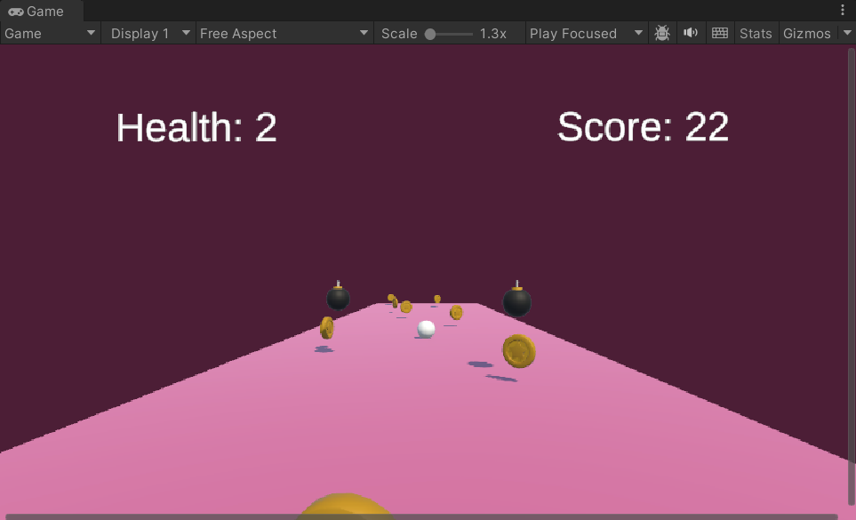

<p align="center">
  
  
</p>

<h1 align="center">🎮 Gold Collector Ball Game</h1>

<p align="center">
  Unity ve C# kullanılarak geliştirilmiş, refleks ve dikkat odaklı basit ama eğlenceli bir arcade oyunudur. Oyuncu, bir topu kontrol ederek gelen altınları toplar, bombalardan kaçınır ve mümkün olduğunca yüksek skor elde etmeye çalışır.
</p>

<p align="center">
  <i>Bu proje; Unity oyun mekaniği, fizik tabanlı hareket ve oyun yönetimi sistemleri üzerindeki yetkinliği göstermek amacıyla geliştirilmiştir.</i>
</p>

---

## 🛠️ Kullanılan Teknolojiler
Oyunun geliştirilme sürecinde kullanılan temel araçlar:

 


---

## 🕹️ Oynanış
* ⌨️ **Kontrol:** Oyuncu klavye yön tuşları ile topu kontrol eder.
* 🪙 **Hedef:** Altınlar rastgele konumlardan gelir, topladıkça skor artar.
* 💣 **Engel:** Bombalara çarpıldığında can azalır.
* ⚰️ **Bitiş:** Can bittiğinde oyun sona erer.

---

## ✨ Özellikler
* 🎯 **Fizik Tabanlı Top Kontrolü:** Rigidbody kullanılarak gerçekçi hareket sistemi.
* 🪙 **Altın Toplama Sistemi:** Trigger ile skor artırma ve ses efekti.
* 💣 **Bomba & Hasar Mekaniği:** Can sistemi ve oyun sonu paneli.
* ❤️ **Can (Health) Yönetimi:** UI üzerinden anlık can takibi.
* 🔊 **Ses Efektleri:** Altın toplama ve bomba çarpma sesleri.
* ⏱️ **Dinamik Zorluk:** Coroutine ile rastgele nesne üretim (spawn) sistemi.

---

## 📸 Ekran Görüntüsü
Oyun tek ekrandan oluşmaktadır.

<p align="center">
  
</p>

---

## 📁 Proje Yapısı
```text
Assets/
├── Scripts/
│   ├── BallControl.cs        # Top hareketi
│   ├── Coin.cs               # Altın toplama
│   ├── CoinSpawner.cs        # Altın üretimi
│   ├── Bomb.cs               # Bomba davranışı
│   ├── HealthManager.cs      # Can sistemi
│   ├── GameManager.cs        # Skor yönetimi
│   └── AudioManager.cs       # Ses yönetimi
